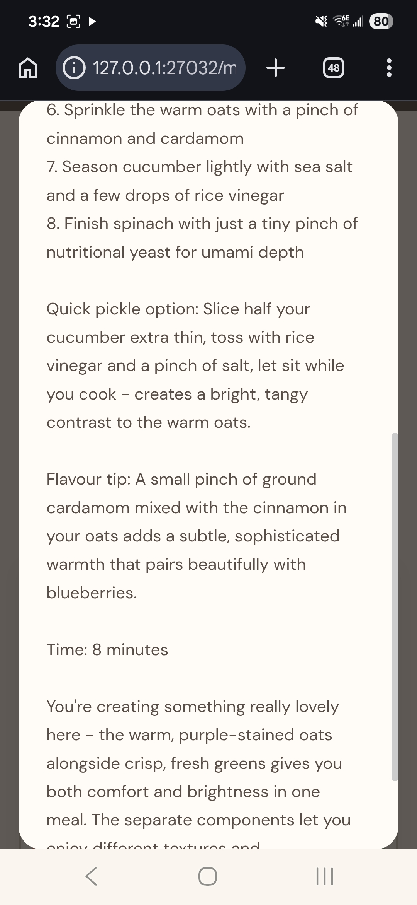
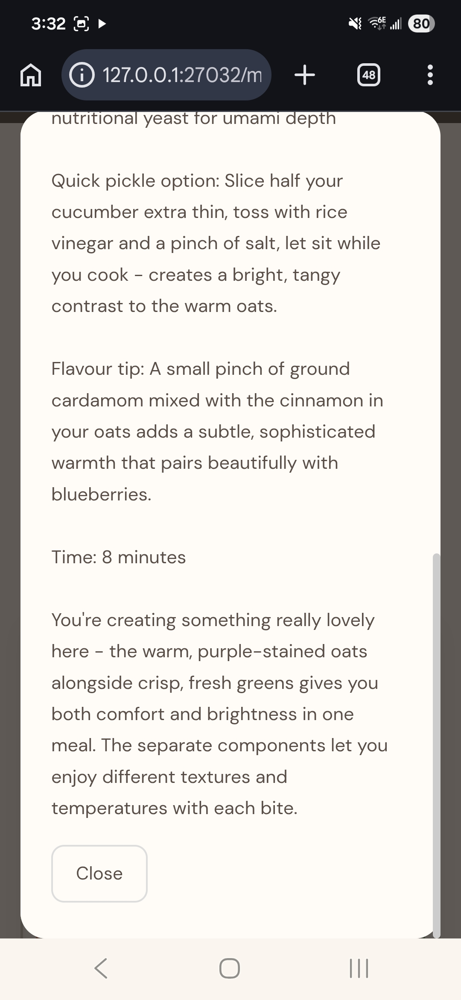
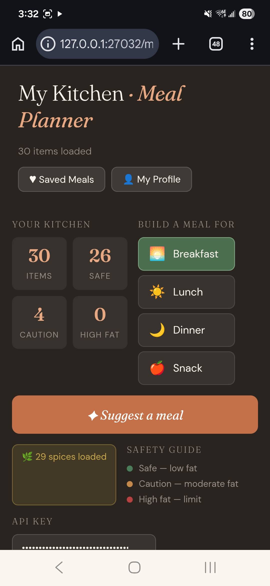
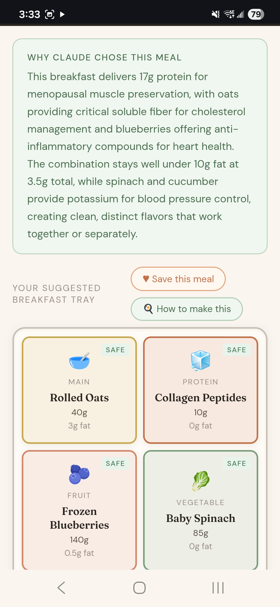
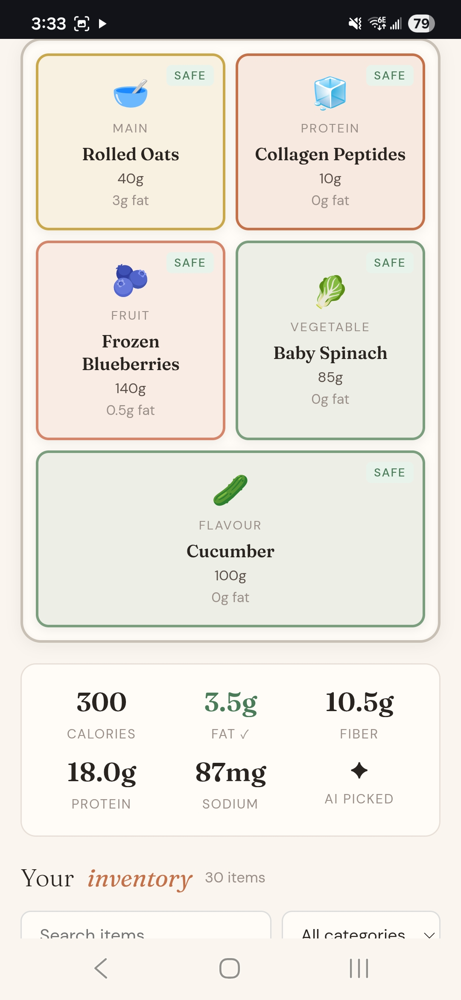
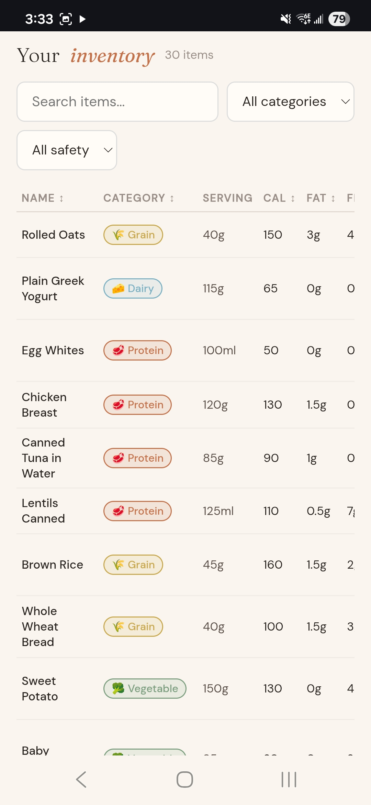

My Kitchen · Meal Planner

An AI-powered meal planning app for people managing gallbladder removal and related health conditions.

What it does

Upload your food inventory as a CSV and Claude AI will automatically categorise your items, then suggest balanced meals tailored to your health profile — keeping each meal under 10g fat, the standard post-cholecystectomy limit.

- Asks for your Anthropic API key on startup — never saved, never stored
- Upload your food inventory CSV and Claude categorises everything automatically, with results cached so you're not charged twice
- Set up a health profile with your conditions (no gallbladder, menopause, heart health, cholesterol, blood sugar, bone density, weight management)
- Choose breakfast, lunch, dinner or snack and get an AI meal suggestion drawn from your actual inventory
- See exactly why Claude chose that combination for your specific conditions
- Get simple step-by-step prep instructions written for non-confident cooks
- Save favourite meals
- Optionally upload a spice inventory so Claude can suggest seasonings from what you actually own

Screenshots

Requirements

- An Anthropic API key get one at [console.anthropic.com](https://console.anthropic.com)
- A food inventory CSV use the included `sample_food_inventory.csv` to get started
- A spice inventory CSV optional, use the included `sample_spice_inventory.csv`
- Just open `meal_planner.html` in any browser, no installation, no server, no dependencies

Getting started

1. Download `meal_planner.html`, `sample_food_inventory.csv` and `sample_spice_inventory.csv`
2. Open `meal_planner.html` in Chrome or Safari
3. Enter your Anthropic API key
4. Upload the sample food CSV to test, or build your own
5. Set up your health profile
6. Pick a meal type and tap Suggest a meal

Who this is for

Anyone managing diet after gallbladder removal (cholecystectomy), especially people also navigating menopause, heart health, cholesterol, blood sugar, or bone density concerns. The app understands your specific conditions and reasons about them when choosing meals it doesn't just count calories.

Built with Claude AI and a lot of patience.
